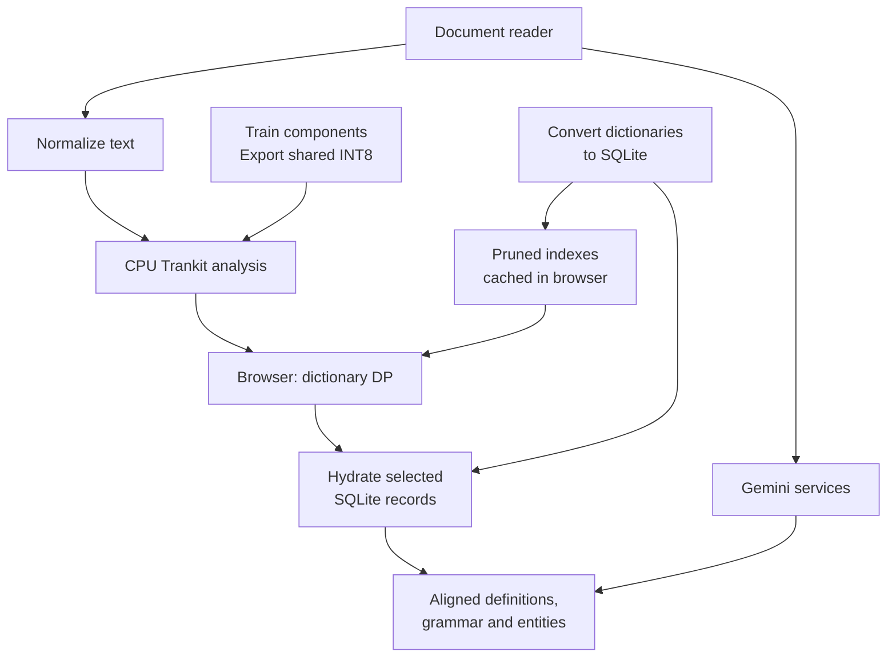

# Language Engine

**A deployed multilingual reading platform combining document reading, neural language analysis, and interactive dictionaries.**

I built Language Engine to bring close reading and language research into one workspace: open a document, select a passage, and inspect its vocabulary, grammar, and named entities without losing the original context.

[Live application](https://language-engine.ai) · [Setup](docs/SETUP.md) · [Architecture](docs/ARCHITECTURE.md) · [Portfolio](https://github.com/conradcompagna)

The fixture uses synthetic responses; full dictionary and neural resources are provisioned separately.

---

## Application architecture

The application combines a browser reading workspace with Flask services, multilingual
neural inference, and a shared dictionary infrastructure.

Accounts, subscriptions and quotas govern the server request paths; document
rendering keeps results attached to the selected passage. Follow the
[construction story](docs/BUILD_PROCESS.md) for source preparation, model selection,
Sanskrit dictionary engineering and CPU export, or the
[runtime guide](docs/ARCHITECTURE.md) for the code behind each request.

### Engineering highlights

- **Hybrid search architecture:** browser-side dynamic programming over compact lexical indexes; batch SQLite hydration fetches full entries only after candidate selection. IndexedDB caches indexes between sessions.
- **Multilingual neural inference:** Trankit integration, multi-word-token alignment, and a shared dynamic-INT8 ONNX encoder with language/task adapter inputs.
- **A complete reading interface:** PDF, ebook, Word, and web-page ingestion; dictionary popups, dependency trees, entity overlays, annotations, pronunciation, and contextual language assistance.
- **Product infrastructure:** Flask authentication, Google sign-in, Stripe subscriptions, server-side quotas and usage budgets, account management, and Gunicorn/Nginx deployment configuration.

### Scope

The code includes **27 language display configurations and enabled NLP registry entries**, covering modern and historical languages. The deployment uses 42 SQLite dictionary files; dictionary contents and model weights remain external to this repository.

### Explore the runtime

| Area | Starting point |
|---|---|
| Application composition and HTTP services | [application factory](language_engine/application.py), [HTTP modules](language_engine/http/), [authentication](auth.py), [billing](payments.py) |
| Browser segmentation and hydration | [dictionary client modules](frontend/dictionary/client/), [browser build and fixture demo](frontend/README.md) |
| Reader UI and document views | [reader modules](frontend/reader/), [snapshot renderer](frontend/documents/snapshot/) |
| Contextual language services | [Gemini task services](language_engine/gemini/README.md) |
| Lexical indexes and SQLite access | [dict_lookup_sqlite.py](dict_lookup_sqlite.py) |
| Neural inference and alignment | [language_registry.py](language_registry.py), [pipeline_common.py](pipeline_common.py), [trankit_compressed_runtime.py](trankit_compressed_runtime.py) |
| Deployment | [wsgi.py](wsgi.py), [deploy/](deploy/) |

The server is organized into Flask blueprints and task services; the browser uses
ES modules with explicit imports and feature-owned state. CI enforces a 2,000-line
limit for maintained files and runs backend, browser, and fixture checks. Follow
the [architecture guide](docs/ARCHITECTURE.md) for the request and data flow.

Model weights, dictionaries, and account data are provisioned separately. See [setup](docs/SETUP.md) and [publication contents](docs/PUBLICATION.md).

---

## How it was built

I developed the models and lexical resources alongside the application: constructing
training corpora, adapting linguistic supervision, comparing model variants, and
building the tools that turn research outputs into deployable assets.

**[`research/`](research/)** — start at [research/README.md](research/README.md).

| | |
|---|---|
| [**From resources to the deployed product**](docs/BUILD_PROCESS.md) | The complete construction path, selected artifacts, measurements and reconstruction checklist. |
| [**Build chains**](research/pipeline/README.md) | Trace corpus construction, model training, and dictionary production from inputs to application assets. |
| [**Training-to-application record**](research/STATUS.md) | Recorded model choices, run identifiers, and artifact-matching tools. |
| [`research/pipeline/`](research/pipeline/) | Model training, dataset construction, dictionary building, NER taxonomy derivation. |
| [`research/evaluation/`](research/evaluation/) | Regression test, benchmarks, latency measurements, dictionary and corpus audits. |
| [`research/experiments/`](research/experiments/) | Six development paths documenting model comparisons, architecture prototypes, and design decisions. |
| [`research/notes/`](research/notes/) | Design and architecture records from development. |
| [`research/datasets/`](research/datasets/), [`research/models/`](research/models/) | Dataset provenance, label vocabularies, and configurations for 29 completed NER runs. |

Two examples show the connection between linguistic analysis and engineering: a
Sanskrit sandhi splitter trained as a multi-word-token expander over a deterministic
Digital Corpus of Sanskrit dataset build, and a task-specific Sanskrit NER corpus
created through a resumable, validated Gemini annotation workflow. The latter records
1,852 API jobs and an estimated annotation cost of USD 0.60.

**[`extras/`](extras/)** — a Chrome extension and a standalone document-renderer test
harness, showing the development of document capture and reading workflows.

## Development and validation

[Development commands](docs/DEVELOPMENT.md) · [Contributing](CONTRIBUTING.md) · [Security](SECURITY.md)

Try the [local fixture demo](docs/SETUP.md), then follow the
[research evidence index](research/EVIDENCE.md) from build decisions to recorded
results and the [reproduction guide](research/REPRODUCIBILITY.md) for checks and new runs.
