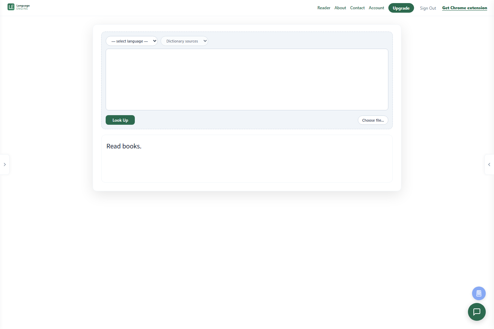

# Language Engine

**A deployed multilingual reading platform combining document reading, neural language analysis, and interactive dictionaries.**

I built Language Engine to bring close reading and language research into one workspace: open a document, select a passage, and inspect its vocabulary, grammar, and named entities without losing the original context.

[Live application](https://language-engine.ai) · [Setup](docs/SETUP.md) · [Architecture](docs/ARCHITECTURE.md) · [Portfolio](https://github.com/conradcompagna)

The fixture uses synthetic responses; full dictionary and neural resources are provisioned separately.

---

## What runs in production

This section describes the application architecture. Repository changes require
an independent build and deployment; the published branch is not a statement of
the current server's exact version.

### Engineering highlights

- **Hybrid search architecture:** browser-side dynamic programming over compact lexical indexes; batch SQLite hydration fetches full entries only after candidate selection. IndexedDB caches indexes between sessions.
- **Multilingual neural inference:** Trankit integration, multi-word-token alignment, and a shared dynamic-INT8 ONNX encoder with language/task adapter inputs.
- **A complete reading interface:** PDF, ebook, Word, and web-page ingestion; dictionary popups, dependency trees, entity overlays, annotations, pronunciation, and contextual language assistance.
- **Product infrastructure:** Flask authentication, Google sign-in, Stripe subscriptions, server-side quotas and usage budgets, account management, and Gunicorn/Nginx deployment configuration.

### Scope

The code includes **27 language display configurations and enabled NLP registry entries**, covering modern and historical languages. The deployment uses 42 SQLite dictionary files; dictionary contents and model weights remain external to this repository.

### Explore the runtime

| Area | Starting point |
|---|---|
| HTTP application and accounts | [router.py](router.py), [auth.py](auth.py), [payments.py](payments.py) |
| Browser segmentation and hydration | [dictionary client modules](frontend/dictionary/client/), [browser build and fixture demo](frontend/README.md) |
| Reader UI and document views | [reader modules](frontend/reader/), [snapshot renderer](frontend/documents/snapshot/) |
| Contextual language services | [Gemini task services](language_engine/gemini/README.md) |
| Lexical indexes and SQLite access | [dict_lookup_sqlite.py](dict_lookup_sqlite.py) |
| Neural inference and alignment | [language_registry.py](language_registry.py), [pipeline_common.py](pipeline_common.py), [trankit_compressed_runtime.py](trankit_compressed_runtime.py) |
| Deployment | [wsgi.py](wsgi.py), [deploy/](deploy/) |

Model weights, dictionaries, and account data are provisioned separately. See [setup](docs/SETUP.md) and [publication contents](docs/PUBLICATION.md).

---

## How it was built

None of this runs in production. It is the offline infrastructure that produced the
models and dictionaries the service loads, the evaluation that gated them, and the work
that was tried and dropped.

**[`research/`](research/)** — start at [research/README.md](research/README.md).

| | |
|---|---|
| [**Build chains**](research/pipeline/README.md) | How each model, dataset and dictionary was actually produced, step by step. Start here. |
| [**Run history**](research/STATUS.md) | Recorded deployment/experiment history; [`check_provenance.py`](research/tools/check_provenance.py) distinguishes size candidates from SHA-256 artifact matches. |
| [`research/pipeline/`](research/pipeline/) | Model training, dataset construction, dictionary building, NER taxonomy derivation. |
| [`research/evaluation/`](research/evaluation/) | Regression test, benchmarks, latency measurements, dictionary and corpus audits. |
| [`research/experiments/`](research/experiments/) | Six lines of work that did not ship, each with an `OUTCOME.md` explaining why. |
| [`research/notes/`](research/notes/) | Sixteen design and architecture documents written during development. |
| [`research/datasets/`](research/datasets/), [`research/models/`](research/models/) | Dataset cards and training configurations for 29 model runs. No corpora, no weights. |

Two examples of what is documented there: the Sanskrit sandhi splitter, trained as a
multi-word-token expander over the Digital Corpus of Sanskrit with a deterministic,
seeded dataset build; and the Sanskrit NER model, trained on a synthetic corpus whose published aggregate records 1,852 Gemini API jobs
and USD 0.6023 of estimated usage; 1,680 validated BIO job artifacts are recorded.
These are dataset-generation figures, not held-out NER accuracy.

**[`extras/`](extras/)** — a Chrome extension and a standalone document-renderer test
harness. Neither is runtime; both stand on their own.

## Development and validation

[Development commands](docs/DEVELOPMENT.md) · [Contributing](CONTRIBUTING.md) · [Security](SECURITY.md)

Start the [local fixture demo](docs/SETUP.md) without private models or account data; review the [research evidence index](research/EVIDENCE.md) for supported ML claims.
