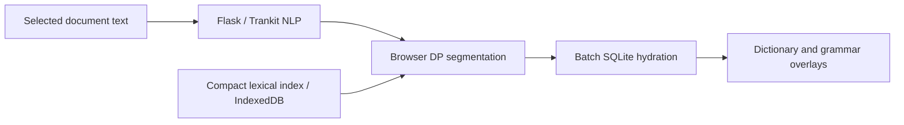

# Language Engine

**A deployed NLP reading platform for close reading across modern and historical languages.**

I built Language Engine to bring dictionary research, grammatical analysis, and document reading into one environment. Readers can work with PDFs, ebooks, Word documents, and captured web pages while inspecting the language of the original text.

[Live application](https://language-engine.ai) · [Portfolio](https://github.com/conradcompagna) · [Setup and external resources](docs/SETUP.md)

## Engineering highlights

- **Hybrid lexical search:** browser-side dynamic programming over compact key indexes, with full dictionary entries hydrated from SQLite only after candidate selection.
- **Multilingual inference:** Trankit integration, custom training workflows, Unicode/offset alignment, multi-word-token expansion, and a shared dynamic-INT8 ONNX encoder with language/task adapter inputs.
- **A complete reading product:** document rendering, dependency and entity overlays, morphology, pronunciation, dictionary editing, and contextual language assistance.
- **Deployed application infrastructure:** Flask, authentication and email verification, Google sign-in, Stripe subscriptions, server-side feature gates, usage budgets, analytics, and Gunicorn/Nginx deployment templates.

## Scope

The published snapshot includes 34 language display configurations and 27 enabled language registry entries. The deployment uses 42 SQLite dictionary files; their contents and all model weights are excluded here. Historical training and dictionary-conversion tools are included so the preparation infrastructure is inspectable alongside the runtime.

## How it works

The active reader is `templates/reader_jshybrid.html`. Its shared dictionary stack is `static/dictionary_client_hybrid.js`, `static/dictionary_engine_hybrid.js`, and `static/reader_wikt.js`. `router.py` supplies the HTTP boundary; `language_registry.py` controls NLP; `dict_lookup_sqlite.py` builds indexes and hydrates entries.

## Explore the code

| Area | Starting points |
|---|---|
| Runtime and deployment | `wsgi.py`, `router.py`, `deploy/` |
| Neural inference | `language_registry.py`, `trankit_onnx_live_switch.py`, `sandbox_trankit_compressed_runtime.py` |
| Model preparation | `training/`, `build_trankit_compressed_runtime_artifacts.py`, `prep_trankit.py` |
| Dictionary preparation | `convert_tsv_to_sqlite.py`, language-specific conversion scripts, `sqlite_prune_policy.py` |
| Account and payment lifecycle | `auth.py`, `payments.py`, `db.py` |
| Application diagnostics | `analytics.py`, `debug_panel.py`, `debug_trace_runtime.py` |

The repository preserves deployed modules, including retained legacy functions. Standalone preparation and experimental scripts are not additional production entrypoints. Historical tools retain their dataset-specific assumptions; inspect their CLI arguments and input paths before running them.

See [publication contents](docs/PUBLICATION.md) for exclusions and [third-party notices](THIRD_PARTY_NOTICES.md).
