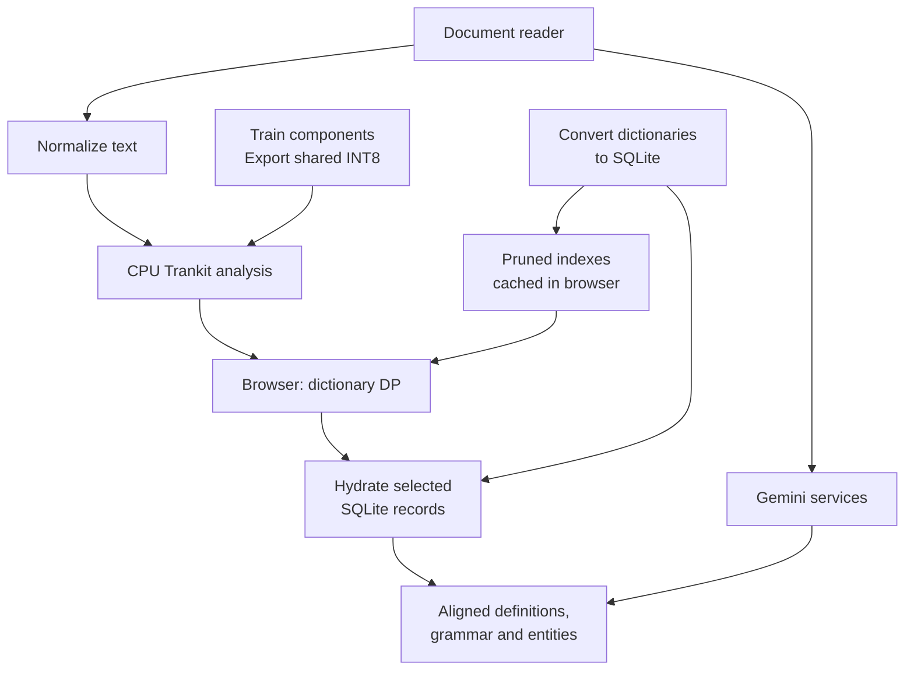

# Language Engine

**A deployed multilingual reading platform combining document reading, neural language analysis, and interactive dictionaries.**

I built Language Engine to bring close reading and language research into one workspace: open a document, select a passage, and inspect its vocabulary, grammar, and named entities without losing the original context.

The work combines multilingual corpus preparation and model training, shared INT8
inference on CPU, dictionary conversion and pruning, browser-side lexical search,
and document rendering. I connected those components through a Flask backend and
an interactive reader, with contextual Gemini services, accounts and subscriptions.

The corpus builders, training configurations, dictionary transformations and run
results below document how I developed the platform.

## Application architecture

The application combines a browser reading workspace with Flask services, multilingual
neural inference, and a shared dictionary infrastructure.

Accounts, subscriptions and quotas govern the server request paths; document
rendering keeps results attached to the selected passage. Follow the
[construction story](docs/BUILD_PROCESS.md) for source preparation, model selection,
Sanskrit dictionary engineering and CPU export, or the
[runtime guide](docs/BUILD_PROCESS.md#runtime-architecture) for the code behind each request.

### Engineering highlights

- **Hybrid search architecture:** browser-side dynamic programming over compact lexical indexes; batch SQLite hydration fetches full entries only after candidate selection. IndexedDB caches indexes between sessions.
- **Multilingual neural inference:** Trankit integration, multi-word-token alignment, and a shared dynamic-INT8 ONNX encoder with language/task adapter inputs.
- **A complete reading interface:** PDF, ebook, Word, and web-page ingestion; dictionary popups, dependency trees, entity overlays, annotations, pronunciation, and contextual language assistance.
- **Product infrastructure:** Flask authentication, Google sign-in, Stripe subscriptions, server-side quotas and usage budgets, account management, and Gunicorn/Nginx deployment configuration.

### Scope

The code includes **27 language display configurations and enabled NLP registry entries**, covering modern and historical languages. The dictionary infrastructure brings 42 SQLite resources into a common lookup and display system.

### Released research models

I have published three model packages from the platform, with native weights,
model cards, training evidence and measured development results:

- [Arabic clitic segmentation](research/releases/arabic-clitic-tokenizer/README.md): a tokenizer and MWT expander trained on corrected CAMeL teacher annotations over authentic news text.
- [Sanskrit sandhi splitting](research/releases/sanskrit-sandhi-tokenizer/README.md): tokenizer and expansion models trained on DCS fused forms and their underlying words.
- [Sanskrit interpretive NER](research/releases/sanskrit-interpretive-ner/README.md): 18 semantic categories learned from Gemini-assisted annotations of authentic Sanskrit documents.

The [full score collection](research/models/TRAINING_RESULTS.md) covers all 61
custom component selections; the [component map](research/STATUS.md) distinguishes
them from the upstream models used elsewhere in the application.

### Explore the runtime

| Area | Starting point |
|---|---|
| Application composition and HTTP services | [application factory](language_engine/application.py), [HTTP modules](language_engine/http/), [authentication](auth.py), [billing](payments.py) |
| Browser segmentation and hydration | [dictionary client modules](frontend/dictionary/client/), [browser module map](frontend/README.md) |
| Reader UI and document views | [reader modules](frontend/reader/), [snapshot renderer](frontend/documents/snapshot/) |
| Contextual language services | [Gemini task services](language_engine/gemini/README.md) |
| Lexical indexes and SQLite access | [dict_lookup_sqlite.py](dict_lookup_sqlite.py) |
| Neural inference and alignment | [language_registry.py](language_registry.py), [pipeline_common.py](pipeline_common.py), [trankit_compressed_runtime.py](trankit_compressed_runtime.py) |
| Deployment | [wsgi.py](wsgi.py), [deploy/](deploy/) |

The server is organized into Flask blueprints and task services; the browser uses
ES modules with explicit imports and feature-owned state. The
[runtime architecture](docs/BUILD_PROCESS.md#runtime-architecture) connects these
boundaries to the request and data flow.

---

## How it was built

I developed the models and lexical resources alongside the application: constructing
training corpora, adapting linguistic supervision, comparing model variants, and
building the tools that turn research outputs into deployable assets.

**[`research/`](research/)** — start at [research/README.md](research/README.md).

| | |
|---|---|
| [**From resources to the deployed product**](docs/BUILD_PROCESS.md) | The construction path, selected artifacts, measurements and evidence by stage. |
| [**Build chains**](research/pipeline/README.md) | Trace corpus construction, model training, and dictionary production from inputs to application assets. |
| [**Training-to-application record**](research/STATUS.md) | Recorded model choices, run identifiers, and artifact-matching tools. |
| [**Selected model scores**](research/models/TRAINING_RESULTS.md) | All 61 custom component selections: tokenizer, MWT, POS/parser, lemma and NER scores, linked to selected checkpoints and original records. |
| [`research/pipeline/`](research/pipeline/) | Model training, dataset construction, dictionary building, NER taxonomy derivation. |
| [`research/evaluation/`](research/evaluation/) | Regression test, benchmarks, latency measurements, dictionary and corpus audits. |
| [`research/experiments/`](research/experiments/) | Six development paths documenting model comparisons, architecture prototypes, and design decisions. |
| [`research/notes/`](research/notes/) | Design and architecture records from development. |
| [`research/datasets/`](research/datasets/), [`research/models/`](research/models/) | Dataset provenance, label vocabularies, and configurations for 29 completed NER runs. |

Two examples show the connection between linguistic analysis and engineering: a
Sanskrit sandhi splitter trained as a multi-word-token expander over a deterministic
Digital Corpus of Sanskrit dataset build, and a task-specific Sanskrit NER corpus
annotated from authentic Sanskrit texts through a resumable, validated Gemini workflow. The latter records
1,852 API jobs and an estimated annotation cost of USD 0.60.

**[Document capture and rendering](extras/)** — the Chrome capture extension and
document-model study, covering static page capture, format conversion, pagination
and annotation geometry.

The [research evidence index](research/EVIDENCE.md) connects selected training
results, annotation costs, corpus statistics and inference measurements to their
source records.
