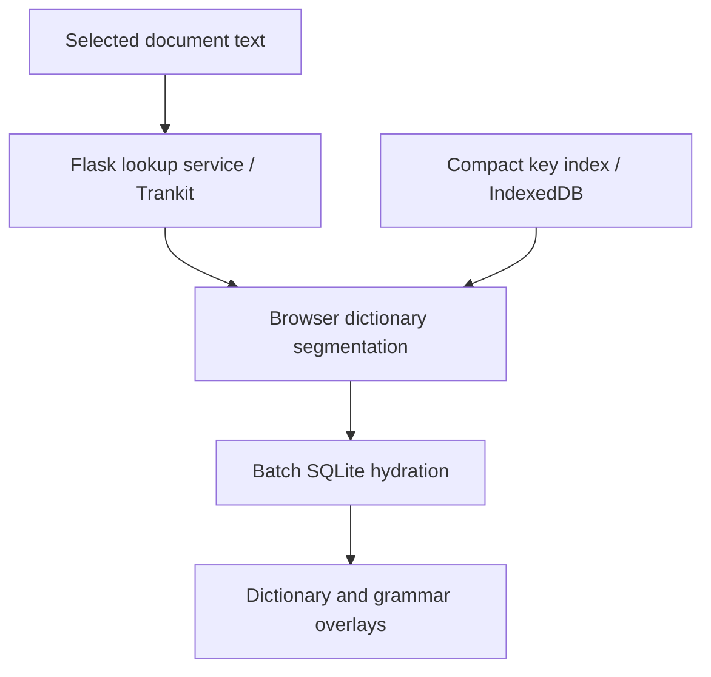

# Application architecture

Language Engine separates neural inference, lexical storage, browser matching,
and interactive reading. The [construction guide](BUILD_PROCESS.md) connects
training and dictionary preparation to these runtime resources. The browser selects dictionary candidates from compact
indexes; the server returns full records for the selected candidates in batches.

## Server composition

| Responsibility | Implementation |
|---|---|
| Application factory and resource initialization | [application.py](../language_engine/application.py), [startup.py](../language_engine/http/startup.py) |
| HTTP lookup and language selection | [lookup.py](../language_engine/http/lookup.py), [language_registry.py](../language_registry.py) |
| Dictionary indexes and hydration | [dictionary_index.py](../language_engine/http/dictionary_index.py), [serializers.py](../language_engine/http/serializers.py), [dict_lookup_sqlite.py](../dict_lookup_sqlite.py) |
| Accounts, subscriptions, and persistence | [auth.py](../auth.py), [payments.py](../payments.py), [db.py](../db.py) |
| Contextual language tasks | [Gemini service modules](../language_engine/gemini/README.md), [api_services.py](../api_services.py) |
| Capture policy and isolation | [capture guide](CAPTURES.md), [capture package](../language_engine/captures/) |
| Deployment entrypoints | [wsgi.py](../wsgi.py), [router.py](../router.py), [deployment templates](../deploy/) |

`create_app()` composes Flask blueprints and accepts explicit resource-loading
and NLP adapters. Importing the factory does not open a database or load a model.
The server entrypoints select production initialization. Database preparation
lives in [database.py](../language_engine/database.py).

Model registries and immutable dictionary index-version maps are shared within
a process. Tests construct isolated databases with `prepare_database=False` and
`load_resources=False`, then inject the NLP and resource adapters they exercise.
HTTP policy checks account tiers and quotas at the blueprint boundary.

## Lookup and dictionary identity

The [request adapter](../frontend/dictionary/client/public-api.mjs) handles
reader lookup calls. [lookup-service.mjs](../frontend/dictionary/client/lookup-service.mjs)
combines server NLP with [surface matching](../frontend/dictionary/client/surface-lookup.mjs)
and the [dictionary engine](../frontend/dictionary/engine/). Side-panel dictionary
lookup uses the same lexical engine without requesting a new neural parse.

Compact indexes carry database and row identifiers. `/js/hydrate` validates the
requested sources, loads selected SQLite records, and builds explicit display
fields. The [hydration contract](../research/notes/HYDRATION_FIRST_RENDERING_REFERENCE.md)
explains how matched forms, headwords, provenance, and display identity travel
together through the interface.

[pipeline_common.py](../pipeline_common.py) prepares NLP overlays and surface
spans; [language_registry.py](../language_registry.py) selects models and display
configurations. [trankit_compressed_runtime.py](../trankit_compressed_runtime.py)
and [trankit_onnx_live_switch.py](../trankit_onnx_live_switch.py) implement shared
compressed-encoder execution. Index construction uses the same JavaScript key
normalization as browser queries through [normalize_keys.js](../tools/normalize_keys.js).

## Browser and document boundaries

[frontend/reader/](../frontend/reader/) owns document interaction, popups, grammar
overlays, and settings. [frontend/dictionary/](../frontend/dictionary/) owns
matching and hydration. [frontend/documents/snapshot/](../frontend/documents/snapshot/)
owns captured-document layout and selection. Feature modules import their
dependencies explicitly and keep mutable state in adjacent state modules.

`npm run build` compiles the entrypoints in [frontend/entries.json](../frontend/entries.json)
into the public assets loaded by [reader_jshybrid.html](../templates/reader_jshybrid.html).
Generated bundles and source maps are build products; maintained browser source
lives under `frontend/`. PDF.js and Foliate provide document rendering services.

Continue with the [browser module map](../frontend/README.md),
[document flow](../research/notes/LOOKUP_RENDERING_PIPELINE_MAP.md), and
[development checks](DEVELOPMENT.md). Model weights and dictionary data are
provisioned as described in [setup](SETUP.md).
