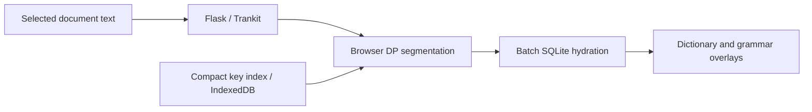

# Architecture

## Reading and lookup

`templates/reader_jshybrid.html` loads the reader. `static/dictionary_client_hybrid.js` intercepts the main `/lookup` request, combines the server's NLP output with client-side segmentation, and requests selected entries from `/js/hydrate`. Side-panel lookup uses the same lexical engine without a new neural parse.

`dict_lookup_sqlite.py` builds compact indexes and retrieves dictionary rows. `tools/normalize_keys.js` supplies the JavaScript normalization used during indexing and is a runtime dependency. `sqlite_prune_policy.py` supplies the shared entry-pruning policy.

`pipeline_common.py` handles NLP results, including the alignment of expanded multi-word tokens back to the selected surface text. `language_registry.py` selects models and loads language display configurations from `wiktionary_general/`. Arabic uses Trankit's native tokenizer. Compressed encoder execution is implemented in `trankit_compressed_runtime.py` and `trankit_onnx_live_switch.py`.

## Application boundaries

`auth.py`, `payments.py`, and `db.py` implement identity, subscription state, and persistence. `api_services.py` and `gemini_dict.py` enforce usage budgets around contextual assistance and generated dictionary entries.

Dictionary-only lookups run in the browser through the shared hybrid engine; the server hydrates the selected entries.

## Repository layout

The root contains the application modules. `static/` and `templates/` contain the browser interface; `deploy/` contains hosting templates. `tools/normalize_keys.js` supplies runtime key normalization. Models and dictionary data are provisioned separately.

`static/foliate-js/` contains the ebook renderer and its browser dependencies. `static/docrender/lookup_chunks.js` groups page geometry into paragraph boundaries during PDF and web-snapshot extraction.
