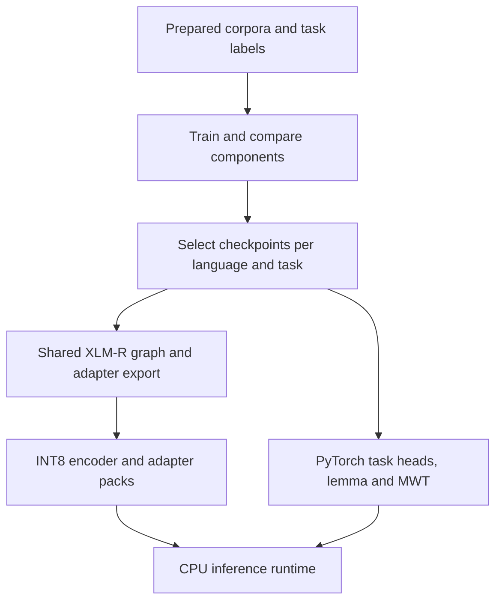

# From linguistic resources to Language Engine

Language Engine grew from two connected problems: obtaining useful linguistic
analysis across modern and historical languages, and making that analysis usable
inside a document reader. I developed the model preparation, dictionary conversion,
CPU inference and browser interaction as parts of the same system.

For a short route through the evidence, read the [selected model map](../research/STATUS.md),
the [training results](../research/models/TRAINING_RESULTS.md), and
the [request architecture](BUILD_PROCESS.md#runtime-architecture). The
[artifact record](../research/models/deployed_artifacts.json) identifies the model
files checked against production on 23 September 2026.

## 1. Construct language-appropriate supervision

The model collection combines existing Trankit resources with components trained
for particular corpora and tasks. Selection happens at component level: a language
can use a tokenizer from one run, a tagger/lemmatizer from another, and a separately
trained NER adapter. The shared model-store directory name is not a language list.

| Construction problem | Transformation and evidence |
|---|---|
| Arabic clitic segmentation | The [CAMeL teacher builder and correction pass](../research/pipeline/datasets/arabic/) convert authentic news text into corrected surface/expansion pairs for the selected tokenizer and MWT model. |
| Sanskrit sandhi | [DCS full-corpus builder](../research/pipeline/datasets/build_dcs_trankit_full_dataset.py) preserves fused surface tokens and underlying MWT children; the [subset builder](../research/pipeline/datasets/build_dcs_trankit_mwt_subset.py) concentrates training on MWT-bearing chapters. |
| Sanskrit entity supervision | The [validated annotation runner](../research/pipeline/datasets/sanskrit/gemini_sanskrit_ner_batch_runner.py) checks returned tokens, saves usage and resumes completed jobs; the [final builder](../research/pipeline/datasets/sanskrit/build_final_sanskrit_gemini_ner_dataset.py) combines validated BIO output and recorded corrections. |
| Historical-language NER | [Old English OEDT](../research/datasets/ang_oedt/README.md) and [Ancient Greek Pausanias](../research/datasets/grc_pausanias_ethnic_civic_misc/README.md) document corpus conversion and task-specific label decisions. |
| Multilingual label inventories | [Taxonomy construction](../research/pipeline/taxonomy/) and [dataset builders](../research/pipeline/taxonomy/dataset_builders/) connect label embeddings, co-occurrence clustering and candidate schemes to training data. |
| Source-specific splits | [Dataset cards](../research/datasets/README.md), per-run configurations and the [evidence index](../research/EVIDENCE.md) record the source, label scheme and split used by each published example. |

The selected Sanskrit MWT development input spans 1,590 DCS chapters and 97,960
expansion candidates. A separate focused-subset preparation track records seed
1337, 1,309 training chapters and 146 development chapters, producing 70,355
training sentences and 9,349 development sentences.
The Sanskrit NER annotation record contains 1,852 API jobs; its final corpus
summary records 1,765 usable chunks, 131,507 token rows and 237 recorded fixes.
These are construction measurements; model evaluation is recorded separately.

## 2. Train, compare and select components

[train_ner.py](../research/pipeline/models/train_ner.py) validates BIO inputs,
drives Trankit training and preserves run evidence and finished artifacts.
[TRAINING_RUN.md](../research/pipeline/models/TRAINING_RUN.md) gives its input,
environment and output contract. The [model collection](../research/models/)
retains configurations and label vocabularies for 29 finished NER runs.

The [selection table](../research/STATUS.md) connects the active language aliases
to the retained work. Examples include Arabic's separate tokenizer/MWT and
tagger/lemma choices, Tagalog's v1/v2 combination, and Sanskrit's DCS components
plus its corrected supervised NER run. The [component results](../research/models/TRAINING_RESULTS.md)
cover all 61 custom selections across tokenization, MWT expansion, parsing,
lemmatization and NER. Representative NER
best-development scores include Old English 88.20 F1, Ancient Greek 78.81, Sanskrit 54.28
and Vietnamese 91.72, each on its own labels and split; the
[saved score excerpts](../research/evaluation/results/ner-training.json)
preserve their source-log hashes and selected epochs.

The artifact inventory distinguishes three facts: a file is provisioned, it is
selected by the registry, and it matches a retained training output. Those facts
are recorded separately so a cached upstream model is not counted as custom training.
The score collection contains 54 historical selected-checkpoint records and seven
fresh development evaluations of retained checkpoints; their input stages and
dataset identities are recorded alongside the scores.

## 3. Package inference for CPU deployment

The deployed bundle uses one shared dynamic-INT8 ONNX encoder with language/task
adapter inputs, rather than an independent full encoder per language. The measured
encoder is **278,515,512 bytes**, compared with **1,110,086,874 bytes** recorded for
the floating-point export: approximately **75% smaller**. The bundle contains 96
adapter packs; its 34 stored aliases include historical resources beyond the 27
current language IDs and Traditional Chinese override.

The [bundle builder](../research/pipeline/models/build_trankit_compressed_runtime_artifacts.py),
[compressed runtime](../trankit_compressed_runtime.py), and
[live-switch integration](../trankit_onnx_live_switch.py) show the export/load path.
The loader also dynamically quantizes supported PyTorch task modules. The
[ORT measurements](../research/evaluation/README.md#onnx-session-tuning) compare
session settings within the INT8 runtime; the file-size result above measures
compression, not a before/after linguistic-accuracy comparison.

## 4. Engineer the dictionaries

The 42 provisioned SQLite files bring heterogeneous lexical resources into a
shared entry/form schema. [Source converters](../research/pipeline/dictionaries/)
handle Wiktionary/Kaikki, JMdict, KRDict, CC-CEDICT, Chinese Notes, LSJ and
Bosworth–Toller, followed by source-specific repairs and
[dictionary audits](../research/evaluation/reports/).

### Reconstructing Sanskrit inflection lookup from DCS

The selected Sanskrit dictionary is built from **Digital Corpus of Sanskrit**
data. [build_sa_sqlite.py](../research/pipeline/datasets/sanskrit/build_sa_sqlite.py)
joins the lemma catalog to token-level `LemmaId` references, interprets grammar
codes and morphological features, and collects observed surface and unsandhied forms.
It then removes headword duplicates and deduplicates the resulting form records.
The verified local build contains **180,000 entries and 479,041 forms**.

A simplified join illustrates the mechanism: a catalog entry with lemma ID `42`
and a corpus token carrying `LemmaId=42` become an entry and an associated form;
the token's case/number features travel with the form. The IDs here are synthetic.
The resulting inflection inventory consists of attested corpus forms, which makes
it useful for recognizing text while retaining its lexical provenance.

The older Monier-Williams conversion is another retained dictionary-development
path; it should not be confused with this selected DCS SQLite build.

### Preserve source databases; derive the browser index

[dict_lookup_sqlite.py](../dict_lookup_sqlite.py) opens dictionaries read-only.
[sqlite_prune_policy.py](../sqlite_prune_policy.py) filters and collapses records
when deriving lookup material, preserving the provisioned source databases during
normal runtime. This separates source preservation from the reader's display policy.

The compact index carries lookup keys and stable database/row references. The
browser [dictionary engine](../frontend/dictionary/engine/) uses those records,
neural lemmas and morphology for candidate selection and segmentation; the
[client](../frontend/dictionary/client/) deduplicates winning references and requests
full records in batches. SQLite hydration returns definitions, matching forms and
provenance only after selection. Shared key normalization keeps both sides aligned.

## 5. Connect analysis to the reading product

Document rendering preserves the page or passage while the selected text passes
through [universal normalization](../universal_normalization.py), the
[language registry](../language_registry.py) and
[surface/token alignment](../pipeline_common.py). Browser overlays reconnect the
NLP and dictionary results to the original selection.

[Gemini services](../language_engine/gemini/README.md) form a separate request
branch for contextual glosses, entry generation, translation, entities and semantic
decomposition. Their modules preserve prompt construction, response schemas and
usage handling. [Authentication](../auth.py), [billing](../payments.py), quotas,
document capture and persistence make these services part of a deployed application.

## Runtime architecture

### Server composition

| Responsibility | Implementation |
|---|---|
| Application factory and resource initialization | [application.py](../language_engine/application.py), [startup.py](../language_engine/http/startup.py) |
| HTTP lookup and language selection | [lookup.py](../language_engine/http/lookup.py), [language_registry.py](../language_registry.py) |
| Dictionary indexes and hydration | [dictionary_index.py](../language_engine/http/dictionary_index.py), [serializers.py](../language_engine/http/serializers.py), [dict_lookup_sqlite.py](../dict_lookup_sqlite.py) |
| Accounts, subscriptions, and persistence | [auth.py](../auth.py), [payments.py](../payments.py), [db.py](../db.py) |
| Contextual language tasks | [Gemini service modules](../language_engine/gemini/README.md), [api_services.py](../api_services.py) |
| Capture policy and isolation | [capture guide](CAPTURES.md), [capture package](../language_engine/captures/) |
| Deployment entrypoints | [wsgi.py](../wsgi.py), [router.py](../router.py), [deployment templates](../deploy/) |

`create_app()` composes Flask blueprints and accepts explicit resource-loading
and NLP adapters. Importing the factory does not open a database or load a model.
The server entrypoints select production initialization. Database preparation
lives in [database.py](../language_engine/database.py).

Model registries and immutable dictionary index-version maps are shared within
a process. HTTP policy checks account tiers and quotas at the blueprint boundary.

### Lookup and dictionary identity

The [request adapter](../frontend/dictionary/client/public-api.mjs) handles
reader lookup calls. [lookup-service.mjs](../frontend/dictionary/client/lookup-service.mjs)
combines server NLP with [surface matching](../frontend/dictionary/client/surface-lookup.mjs)
and the [dictionary engine](../frontend/dictionary/engine/). Side-panel dictionary
lookup uses the same lexical engine without requesting a new neural parse.

Compact indexes carry database and row identifiers. `/js/hydrate` validates the
requested sources, loads selected SQLite records, and builds explicit display
fields. The [hydration contract](../research/notes/HYDRATION_FIRST_RENDERING_REFERENCE.md)
explains how matched forms, headwords, provenance, and display identity travel
together through the interface.

[pipeline_common.py](../pipeline_common.py) prepares NLP overlays and surface
spans; [language_registry.py](../language_registry.py) selects models and display
configurations. [trankit_compressed_runtime.py](../trankit_compressed_runtime.py)
and [trankit_onnx_live_switch.py](../trankit_onnx_live_switch.py) implement shared
compressed-encoder execution. Index construction uses the same JavaScript key
normalization as browser queries through [normalize_keys.js](../tools/normalize_keys.js).

### Browser and document boundaries

[frontend/reader/](../frontend/reader/) owns document interaction, popups, grammar
overlays, and settings. [frontend/dictionary/](../frontend/dictionary/) owns
matching and hydration. [frontend/documents/snapshot/](../frontend/documents/snapshot/)
owns captured-document layout and selection. Feature modules import their
dependencies explicitly and keep mutable state in adjacent state modules.

`npm run build` compiles the entrypoints in [frontend/entries.json](../frontend/entries.json)
into the public assets loaded by [reader_jshybrid.html](../templates/reader_jshybrid.html).
Generated bundles and source maps are build products; maintained browser source
lives under `frontend/`. PDF.js and Foliate provide document rendering services.

## Evidence by stage

| Stage | Engineering work | Record |
|---|---|---|
| Supervision | Corpus conversion, label design, annotation validation and deterministic splits | [Dataset cards](../research/datasets/README.md), [corpus builders](../research/pipeline/datasets/), [annotation records](../research/pipeline/datasets/sanskrit/gemini_ner/). |
| Model selection | Component-level combinations and selected NER runs | [Active model map](../research/STATUS.md), [configurations and scores](../research/models/README.md), [training procedure](../research/REPRODUCIBILITY.md). |
| CPU inference | Shared encoder export, INT8 adapters and session tuning | [Runtime builders](../research/pipeline/models/), [measurements](../research/evaluation/README.md), [artifact identities](../research/models/deployed_artifacts.json). |
| Dictionaries | Source conversion, DCS lemma/form joins, repairs and display policies | [Dictionary build chains](../research/pipeline/README.md#3-dictionaries), [audits](../research/evaluation/reports/), [pruning policy](../sqlite_prune_policy.py). |
| Reading product | Neural/surface alignment, browser matching, hydration and contextual services | [Browser modules](../frontend/README.md), [HTTP services](../language_engine/http/), [Gemini modules](../language_engine/gemini/README.md). |
