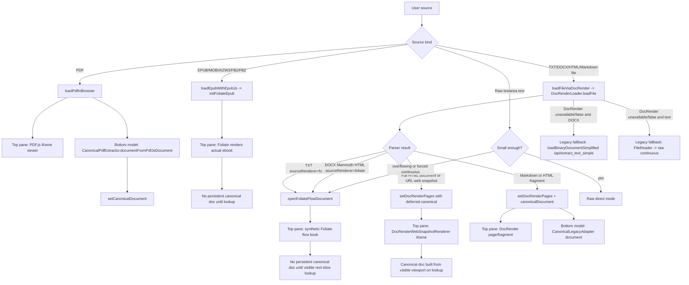
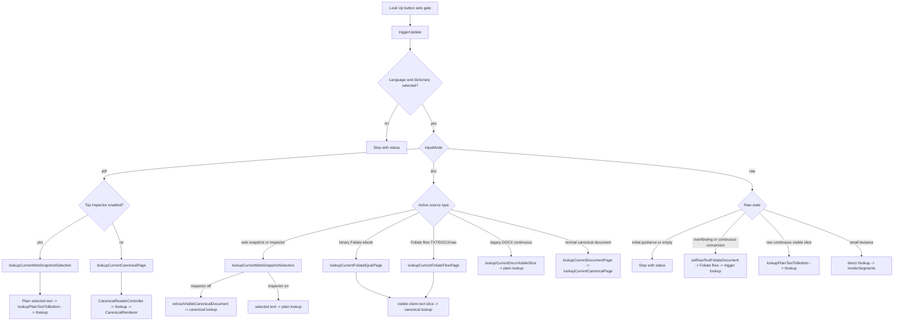

# Lookup And Rendering Pipeline Map

Last traced: 2026-05-01

Scope: active `reader_jshybrid.html` runtime only. This traces the current paths from source loading to lookup to bottom-pane rendering for PDFs, raw text, TXT files, ebooks through Foliate, DOCX through Mammoth then Foliate, HTML/URL web snapshots, and Markdown/HTML fragments.

## Counts At A Glance

| Thing counted | Count | What it means |
| --- | ---: | --- |
| Active network/dictionary lookup chains | 2 | `/lookup` for normal Trankit-backed lookup, and `/lookup_dp_only` for side-panel single-token lookup. |
| Look Up button dispatch branches | 10 | Branches reachable from `triggerUpdate()` before they converge on `/lookup` or a renderer. |
| Bottom rendering families | 3 | Canonical renderer, plain linear `renderSegments()`, and legacy DOM decoration. |
| Layout/extraction algorithms present | 10 | 7 primary/current surfaces plus 3 legacy or conditional surfaces. |

The important split: the app has only 2 active dictionary lookup chains, but the reader UI still has about 10 ways to decide what text/geometry to send into the main `/lookup` chain.

## The Two Active Dictionary Lookup Chains

```mermaid
flowchart TD
  A[Any normal reader lookup] --> B[startSegmentLookupFetch(buildLookupUrl(text))]
  B --> C[dictionary_client_hybrid.wrapFetch intercepts /lookup]
  C --> D[router.py /lookup]
  D --> E[Trankit NLP only: tokens, lemma, UPOS, XPOS, UD, NER]
  E --> F[hybridSegmentAndHydrate]
  F --> G[buildSinglePassSurfaceLookup client-side DP]
  G --> H[hydrateWinnerRefs POST /js/hydrate]
  H --> I[SQLite hydration in router.py]
  I --> J[merged payload: results_by_seg, entry_store, overlays]
  J --> K[Caller-specific renderer]

  L[Side panel single-token lookup] --> M[dictionary_client_hybrid.wrapFetch intercepts /lookup_dp_only]
  M --> N[hybridDpOnlyLookup]
  N --> G
```

Notes:

- `/lookup` is the main active chain for all document and raw-text Look Up button flows.
- `/lookup_dp_only` is active because `dictionary_client_hybrid.js` intercepts it client-side. The server-side route exists but is not the live dictionary path.
- `/lookup?raw=1`, `/subsegments`, `/api/lookup_batch`, `/api/lookup_single`, server-side DP segmentation, and `sqlite_segmenter.py` are legacy/defunct for the current reader pipeline.

## Source Loading Flow



Important active bypasses:

- PDF files deliberately skip `DocRenderLoader.loadFile()` even though `DocRenderParsers.parsePdfFile()` exists.
- Binary ebook files deliberately skip `DocRenderLoader.loadFile()` even though `DocRenderParsers.parseEpubFile()` exists.
- DOCX normally goes Mammoth -> Foliate flow. The `/api/extract_text_simple` DOCX path is only a fallback if the DocRender path is unavailable.

## Look Up Button Dispatch

Current dispatch is centralized in `triggerUpdate()` in `static/reader.js`.



The 10 Look Up dispatch branches are:

| # | Branch | Current status | Bottom renderer |
| ---: | --- | --- | --- |
| 1 | PDF canonical page | Primary | Canonical fixed renderer |
| 2 | PDF/top-source inspector selection | Conditional | Plain `renderSegments()` |
| 3 | Web snapshot visible canonical slice | Primary for full HTML/URL with inspector off | Canonical web rect-slice renderer |
| 4 | Web snapshot inspector selection | Conditional | Plain `renderSegments()` |
| 5 | Binary ebook Foliate visible rect slice | Primary for EPUB/MOBI/AZW3/FB2/FBZ | Canonical web rect-slice renderer |
| 6 | Foliate flow visible rect slice | Primary for TXT file, DOCX via Mammoth, and overflowing raw text | Canonical web rect-slice renderer |
| 7 | Normal DocRender canonical page | Primary for Markdown/HTML fragments and legacy plain page docs | Canonical flow/fixed renderer |
| 8 | Legacy DOCX continuous visible slice | Legacy/conditional | Plain `renderSegments()` |
| 9 | Raw continuous visible slice | Legacy/conditional after old raw continuous mount | Plain `renderSegments()` |
| 10 | Small raw textarea direct lookup | Primary for short typed text | Plain `renderSegments()` |

Oversized raw text is a conversion branch, not a separate final renderer: it becomes a Foliate flow document and then uses branch 6.

## Bottom Rendering Convergence

```mermaid
flowchart TD
  A[Text or canonical page chosen by dispatch] --> B{Representation}

  B -->|CanonicalDocument page| C[CanonicalReaderController.lookupAndRenderPage]
  C --> D[/lookup -> hybrid DP + /js/hydrate]
  D --> E[CanonicalAnnotator.annotatePage]
  E --> F[CanonicalRenderer.renderPage]
  F --> F1{Canonical page layout}
  F1 -->|source.kind=webSnapshotRectSlice| F2[appendWebRectSlicePage]
  F1 -->|layout.mode=fixed| F3[appendFixedPage]
  F1 -->|otherwise| F4[flow page append]

  B -->|Plain selected/visible text| G[lookupPlainTextToBottom]
  G --> H[/lookup -> hybrid DP + /js/hydrate]
  H --> I[renderSegments(data, text)]

  B -->|Existing rich DOM slice| J[decorateExistingDomSlice / decorateRichSlice]
  J --> K[/lookup -> hybrid DP + /js/hydrate]
  K --> L[apply offsets as token spans on existing DOM]
```

Canonical rendering is the main convergence point. It is used by:

- PDFs after `CanonicalPdfExtractor`.
- Markdown/HTML fragments after `CanonicalLegacyAdapter`.
- Web snapshot visible viewport slices.
- Foliate binary ebook visible viewport slices.
- Foliate flow visible viewport slices from TXT, DOCX, and large raw text.

Plain `renderSegments()` is still used by:

- Short raw text.
- Inspector-selected text.
- Legacy raw continuous visible slices.
- Legacy DOCX continuous visible slices.

Legacy DOM decoration still exists, but `lookupCurrentDocumentPage()` now refuses to fall back to it when no canonical document exists. Treat it as old code unless a specific button/event still calls it.

## Layout And Extraction Algorithms Present

| # | Algorithm/surface | Used for | Current role |
| ---: | --- | --- | --- |
| 1 | PDF.js iframe viewer | Top pane for PDF | Primary source renderer |
| 2 | `CanonicalPdfExtractor` fixed-layout text extraction | Bottom canonical model for PDF | Primary lookup model |
| 3 | Foliate binary ebook renderer | Top pane for EPUB/MOBI/AZW3/FB2/FBZ | Primary source renderer |
| 4 | Foliate synthetic flow renderer | Top pane for TXT, DOCX via Mammoth, large raw text | Primary source renderer |
| 5 | Web snapshot iframe renderer | Top pane for full HTML files and URLs | Primary source renderer |
| 6 | Client-rect visible slice extractor | Web snapshots and Foliate viewports | Primary lookup geometry model |
| 7 | `CanonicalLegacyAdapter` from DocRender pages | Markdown/HTML fragments and old page docs | Primary for non-Foliate canonical docs |
| 8 | `CanonicalRenderer` flow/fixed/web-rect modes | Bottom pane canonical output | Primary bottom renderer |
| 9 | Raw textarea visible slice metrics | Old raw continuous path | Legacy/conditional |
| 10 | Legacy rich DOM visible-slice decoration | Older DOCX/rich DOM paths | Legacy/conditional |

If you count only geometric extraction/layout engines, the primary set is 7: PDF.js, CanonicalPdfExtractor, Foliate, WebSnapshot iframe, client-rect slice extraction, CanonicalLegacyAdapter, and CanonicalRenderer. If you include legacy surfaces and linear text rendering, the practical cleanup surface is 10.

## Per-Format Trace

| Source | Load path | Top pane | Lookup path | Bottom pane |
| --- | --- | --- | --- | --- |
| PDF | `loadPdfInBrowser()` | PDF.js iframe | `lookupCurrentCanonicalPage()` | Canonical fixed page |
| Short raw text | textarea raw mode | textarea | direct `/lookup` | `renderSegments()` |
| Overflowing raw text | `setRawTextFoliateDocument()` -> `DocRenderLoader.loadText()` | Foliate synthetic flow | `lookupCurrentFoliateFlowPage()` | Canonical web rect slice |
| TXT file | `loadFileViaDocRender()` -> `parseTxtString()` | Foliate synthetic flow | `lookupCurrentFoliateFlowPage()` | Canonical web rect slice |
| DOCX | `loadFileViaDocRender()` -> Mammoth -> `parseDocxFile()` | Foliate synthetic flow | `lookupCurrentFoliateFlowPage()` | Canonical web rect slice |
| EPUB/MOBI/AZW3/FB2/FBZ | `loadEpubWithEpubJs()` -> `initFoliateEpub()` | Foliate actual ebook | `lookupCurrentFoliateEpubPage()` | Canonical web rect slice |
| Full HTML file | `parseHtmlFile()` full document branch | Web snapshot iframe | visible canonical slice, or inspector selected text | Canonical web rect slice, or `renderSegments()` |
| URL | `loadUrlViaDocRender()` -> `parseUrl()` | Web snapshot iframe | visible canonical slice, or inspector selected text | Canonical web rect slice, or `renderSegments()` |
| HTML fragment | `parseHtmlString()` | DocRender page/fragment | `lookupCurrentDocumentPage()` | Canonical flow/fixed page |
| Markdown | `parseMarkdownFile()` -> `parseHtmlString()` | DocRender page/fragment | `lookupCurrentDocumentPage()` | Canonical flow page |

## Branches And Fallbacks To Standardize

### Web Snapshot Fetch Fallbacks

```mermaid
flowchart TD
  A[parseUrl] --> B[/api/monolith_snapshot]
  B -->|success| C[webSnapshot source page]
  B -->|fail and renderJs=true| D[throw error]
  B -->|fail and WEB_SNAPSHOT_USE_PLAYWRIGHT| E[Playwright snapshot service]
  E -->|success| C
  E -->|fail| F[direct CORS fetch]
  F -->|success| C
  F -->|fail| G[CORS proxy]
  G --> C
```

### Foliate Lookup Geometry

```mermaid
flowchart TD
  A[Foliate rendered iframe(s)] --> B[getFoliateEpubSliceContext]
  B --> C[getFoliateViewportClipForDoc]
  C --> D[choose document iframe with largest visible intersection]
  D --> E[buildFoliateRectSliceState]
  E --> F[DocRenderWebSnapshotRenderer.extractVisibleCanonicalDocument]
  F --> G[CanonicalReaderController.lookupAndRenderPage]
```

This path now ignores Foliate internal page range guesses for lookup. It walks text in the actually visible iframe/document viewport and uses client rects as the source of truth.

### Bottom-Pane Clipping/Scrolling

Foliate and web snapshot rect-slice lookups produce canonical pages with `source.kind = webSnapshotRectSlice`. `CanonicalRenderer.appendWebRectSlicePage()` marks `#renderedText` as `canonical-web-rect-slice-active` and uses native `overflow: auto`, so the browser decides whether scrollbars are needed.

### Legacy/Conditional Branches

- `loadBinaryDocumentSimplified()` is a DOCX fallback only when `loadFileViaDocRender()` does not take the file.
- Text file FileReader/raw-continuous loading is a fallback only when DocRender does not take the file.
- `DocRenderParsers.parsePdfFile()` exists but is bypassed by active `loadFile()` for PDFs.
- `DocRenderParsers.parseEpubFile()` exists but is bypassed by active `loadFile()` for binary ebooks.
- `decorateExistingDomSlice()` and `decorateRichSlice()` still exist, but the main document lookup path now expects canonical documents.

## Practical Standardization Targets

1. Collapse all bottom-pane document output onto `CanonicalReaderController -> CanonicalRenderer`.
2. Convert plain selected text and short raw text into small canonical flow documents if you want to eliminate `renderSegments()` as a separate document renderer.
3. Keep `/lookup` as the only normal document lookup network path; reserve `/lookup_dp_only` for side-panel token lookup.
4. Decide whether TXT/DOCX/raw large text should remain Foliate source documents or become direct canonical flow documents with a separate source preview.
5. Remove or quarantine legacy branches after replacement: `loadBinaryDocumentSimplified()`, raw continuous textarea slicing, rich DOM decoration, active references to `parsePdfFile()` and `parseEpubFile()` from DocRender.
6. Normalize source renderer kinds into a small enum: `pdfjs`, `foliateBinary`, `foliateFlow`, `webSnapshot`, `canonicalFlow`.

