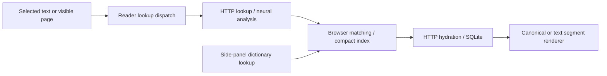

# Document loading, lookup, and rendering

The reader brings PDF, ebook, Word, web, and plain-text inputs into a common
reading workflow: display the source, select text or a visible page, obtain
linguistic and lexical annotations, and render them against the source geometry.

## Source formats

| Input | Source display | Lookup representation |
|---|---|---|
| PDF | PDF.js iframe viewer | Canonical text and fixed page geometry |
| EPUB, MOBI, AZW3, FB2, FBZ | Foliate ebook renderer | Text and client rectangles from the visible viewport |
| DOCX | Mammoth conversion and Foliate flow view | Visible flow-document slice |
| TXT and long raw text | Foliate flow view | Visible flow-document slice |
| Full HTML and captured web pages | Isolated snapshot frame | Visible canonical slice or selected text |
| Markdown and HTML fragments | Document page renderer | Canonical flow/fixed document |
| Short typed text | Text input | Direct text lookup and segment rendering |

The [capture guide](../../docs/CAPTURES.md) describes storage policy and iframe
isolation for imported HTML and web snapshots.

## Code map

| Responsibility | Maintained source |
|---|---|
| File and URL import | [document-import.mjs](../../frontend/reader/document-import.mjs) |
| Source document state and mounting | [document-state.mjs](../../frontend/reader/document-state.mjs), [document-shell.mjs](../../frontend/reader/document-shell.mjs) |
| Navigation and search | [document-navigation.mjs](../../frontend/reader/document-navigation.mjs), [document-search.mjs](../../frontend/reader/document-search.mjs) |
| Lookup dispatch | `triggerUpdate()` in [fill-slices.mjs](../../frontend/reader/fill-slices.mjs) |
| Foliate viewport extraction | [foliate-viewport.mjs](../../frontend/reader/foliate-viewport.mjs), [foliate-slices.mjs](../../frontend/reader/foliate-slices.mjs) |
| Snapshot layout and selection | [snapshot modules](../../frontend/documents/snapshot/) |
| Text offsets and segment display | [text-offsets.mjs](../../frontend/reader/text-offsets.mjs), [segment-rendering.mjs](../../frontend/reader/segment-rendering.mjs) |
| Canonical document adapters | [document-rendering services](../../static/docrender/) |

## Shared lookup flow

[public-api.mjs](../../frontend/dictionary/client/public-api.mjs) routes the
reader's lookup requests into [lookup-service.mjs](../../frontend/dictionary/client/lookup-service.mjs).
Document lookups combine NLP with dictionary matching; side-panel lookups use
dictionary matching directly. Both receive the same explicit hydrated entry
fields described in the [hydration guide](HYDRATION_FIRST_RENDERING_REFERENCE.md).

Canonical rendering retains page geometry for fixed pages and visible rectangle
slices. Plain-text selection uses the segment renderer. Format-specific adapters
handle import and geometry, while dictionary and linguistic display share the
same lookup payload. See [frontend/README.md](../../frontend/README.md) for build
entrypoints and browser checks.
